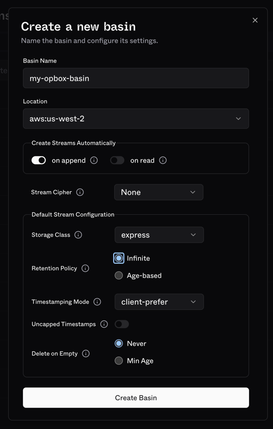

# Quickstart

## Prerequisites

### Install opbox

#### Install script (recommended)

```bash
curl -fsSL https://opbox.dev/install.sh | bash
```

This installs the latest release binaries (`ob` and `opbox-daemon`) into `~/.local/bin`. Feel free to [read the script](https://opbox.dev/install.sh) before running it.

Options such as `OPBOX_VERSION`, `OPBOX_INSTALL_DIR`, and `OPBOX_INSTALL_FROM_SOURCE=1` are documented at the top of the script.

#### From a release archive

Download an archive for your platform from [GitHub releases](https://github.com/s2-streamstore/opbox/releases), then place both `ob` and `opbox-daemon` in the same directory on your `$PATH`.

#### From source

```bash
cargo install --locked --path crates/client
cargo install --locked --path crates/daemon
```

You should have `ob` and `opbox-daemon` in your `$PATH` now.

## S2 configuration

S2 is used as the shared journal across opbox daemons. This is how CRDT ops are shared.

It can be used in its serverless offering (s2.dev), or you can run S2 yourself.

### Using `s2.dev`

Go to [s2.dev](http://s2.dev) and make an account. You can sign on with SSO and get started immediately. All new signups get $10 of credits, which is way more than enough for any reasonable `opbox` workspace.

> [!NOTE]
> Do put down a payment method in order to be able to make streams with infinite retention. The free tier (no payment method listed) is restricted to 28 day data retention. In other words, your workspace will break after 4 weeks unless you do this.

Create an access token on the UI, and hold on to it. You can accept all of the defaults when creating this token. Don't share it with anyone else!

Next, create a basin, making sure that:
- The retention policy is set to `Infinite` (age-based TTLs will work for short-lived workspaces)



If you have the `s2` CLI installed, you could also use it to create a basin:

```bash
s2 create-basin \
  my-opbox-basin \
  --retention-policy infinite
```

Configure your local opbox using your access token and basin name:

```bash
ob config set access-token "MY_TOKEN"
ob config set default-basin "MY_BASIN"
```

`ob config` writes to an OS user-level opbox config file by default. These values become the defaults for every opbox workspace you create or clone as this OS user. Use `ob config --workspace ...` inside a workspace when one workspace needs its own basin, access token, endpoints, or daemon log level.

At this point, you're set.

### Using `s2-lite` (self-hosted)

If you want to run S2 yourself, follow the instructions [here](https://github.com/s2-streamstore/s2).

Your S2 instance will need to be accessible to all opbox daemons.

For quickly testing opbox out, you can simply run multiple daemons on the same machine that you are running s2-lite on, and access it via localhost.

```bash
# start s2-lite
s2 lite
```
Then in terminals where you want to use opbox, or otherwise interact with S2, set the following environment variables:
```bash
export S2_ACCOUNT_ENDPOINT=http://localhost:80
export S2_BASIN_ENDPOINT=http://localhost:80
export S2_ACCESS_TOKEN=ignored
export S2_BASIN=my-test-basin
```

You will also need to create a basin:
```bash
s2 create-basin \
  $S2_BASIN \
  --retention-policy infinite
```

## Create your first workspace

You can use an existing directory, or create a new one. I'll assume the latter for now.

```bash
mkdir -p ~/my-opbox-workspace
cd ~/my-opbox-workspace

# init the workspace
ob init
```

You should see something like this:

```console
me@mac my-opbox-workspace % ob init
initialized opbox workspace
  basin          my-opbox-basin 
  root           /Users/me/my-opbox-workspace
  cipher         89abcdefghjkmnpqrstvwxyz23456789abcdefghjkmnpqrstuvw

your workspace is: wersq5ks6776xwqhdpycs835g4w6pg7z

  share token    opbox-wersq5ks6776xwqhdpycs835g4w6pg7z-bootstrap

share this clone command (contains limited access token and workspace cipher):

  ob clone \
    --workspace wersq5ks6776xwqhdpycs835g4w6pg7z \
    --access-token I7oAAAAAAABqRXQ5hghQl6Kc8xJtVmqcc5k5Skpnzg6jVKew \
    --cipher 89abcdefghjkmnpqrstvwxyz23456789abcdefghjkmnpqrstuvw \
    --basin my-opbox-basin 

run ob start to begin syncing
```

Great, it worked.

At this point, the workspace has been created, and an initial snapshot has been successfully sent to S2.

Anyone who wants to sync can clone this workspace using the command printed above.

> [!TIP]
> 
> The `access-token` printed in the `ob clone` command is created during initialization, and constrained to the current workspace. It's not a global access token.
> 
> Sharing it will not allow others to create new workspaces using your account. The `cipher` is the workspace encryption key; share it only with people who should be able to decrypt workspace contents.
> 
> You can create per-user share tokens, revoke tokens, and list all with `ob share`.

To listen for local changes and apply remote changes, start the daemon:
```bash
ob start
```

> [!TIP]
> Most `ob` commands operate on the local workspace. If your `$PWD` is not in a workspace directory (or a subdirectory of it), they won't work. Similar to `git`.
>
> `ob config` is user-wide by default. Add `--workspace` to read or write `.opbox/config.toml` for the current workspace.

## Cloning an existing workspace

> [!NOTE]
> Make sure your opbox config is correct. If you did the S2 setup steps, send the access token, cipher, and basin to anyone you want to share your workspace with. They can set the S2 values globally with `ob config`, or for one clone with `ob clone --workspace ... --cipher ... --basin ... --access-token ...`.

This will likely be done on another computer.

```bash
mkdir -p ~/my-opbox-workspace-clone-1
cd ~/my-opbox-workspace-clone-1

# the directory must be empty to start
# then, use the workspace id from earlier
ob clone \
  --workspace wersq5ks6776xwqhdpycs835g4w6pg7z \
  --access-token I7oAAAAAAABqRXQ5hghQl6Kc8xJtVmqcc5k5Skpnzg6jVKew \
  --cipher 89abcdefghjkmnpqrstvwxyz23456789abcdefghjkmnpqrstuvw \
  --basin my-opbox-basin 

# and finally, start syncing
ob start
```

